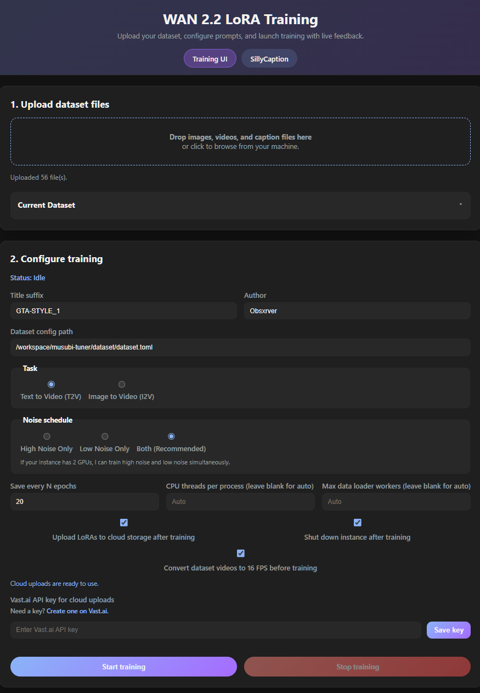
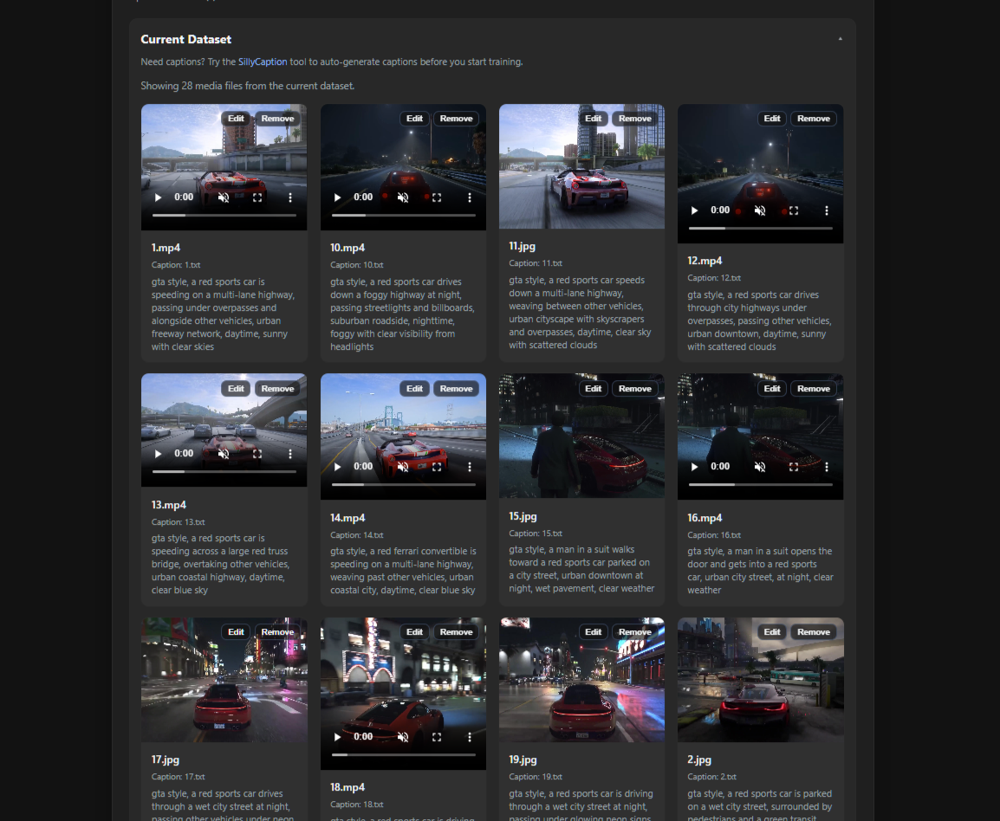
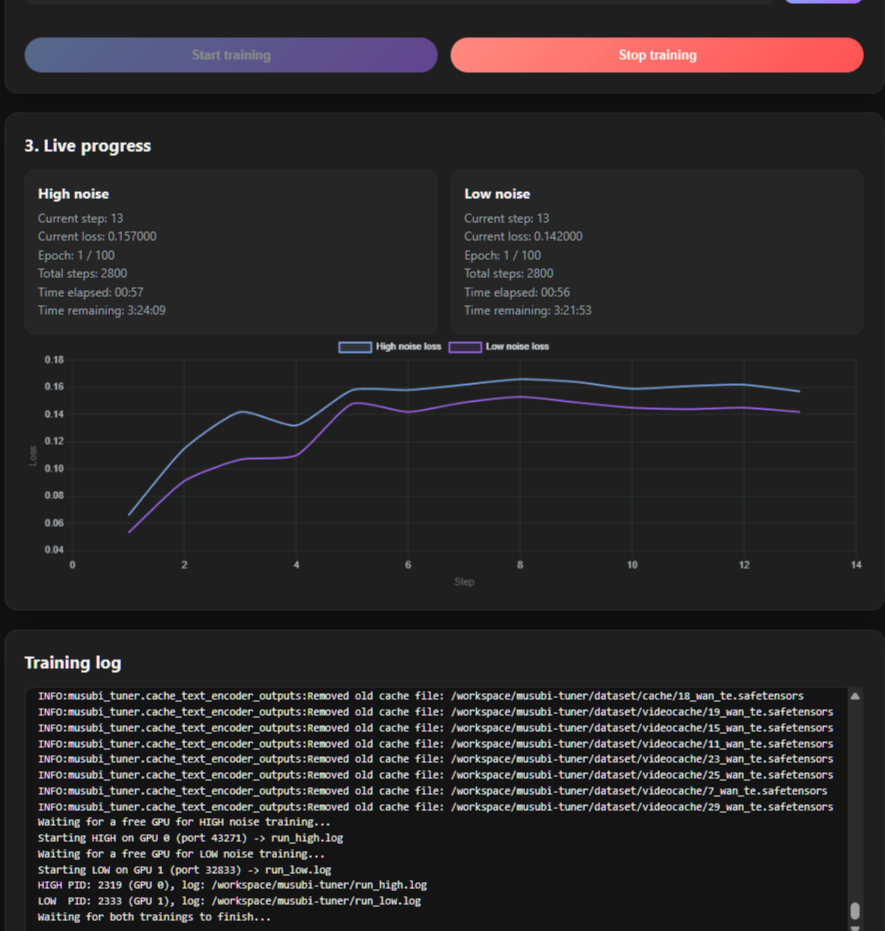

# Wan 2.2 LoRA Training WebUI

A full-featured WebUI for training Wan 2.2 LoRAs on Vast.AI. Supports both Text-to-Video (T2V) and Image-to-Video (I2V) training with real-time monitoring and cloud uploads.

### Looking for help with captioning? Auto-caption in under a minute with [https://obsxrver.pro/SillyCaption](https://obsxrver.pro/SillyCaption)

## Quick Start on Vast.ai

### 1. Launch via Template

Use the pre-built template to skip manual setup. This template automatically installs dependencies, downloads the 14B models (T2V & I2V), and launches the WebUI.

- **Template:** [Wan 2.2 LoRA Training Quickstart](https://cloud.vast.ai/?ref_id=208628&creator_id=208628&name=Wan%202.2%20LoRA%20Training%20Quickstart)

**Recommended Hardware:**
- **2x RTX 5090 / 2x H100:** Recommended for concurrent High + Low noise training.
- **1x RTX 5090 / 1x H100:** Can train one noise level at a time (High or Low).

### 2. Access the WebUI

Once the instance is running (wait a few minutes for the startup script to finish downloading models):
1.  Click the **"Open"** button on your Vast.AI instance.
2.  Select **"wan-training-webui"** from the portal menu.
3.  The UI will open in your browser.

## Features

- **Drag-and-Drop Dataset Manager:** Upload images, videos, and caption files directly from your browser.
- **Live Training Monitor:** Watch loss curves and step progress in real-time.
- **Dual-GPU Support:** Automatically utilizes multiple GPUs to train High and Low noise models simultaneously.
- **Vast.AI Cloud Integration:** Automatically uploads finished LoRAs to your configured cloud storage.
- **Cost Saving:** Option to automatically shut down the instance when training completes.
- **Video Tools:** Built-in converter to standardize dataset videos to 16 FPS.

## Training Workflow

### 1. Prepare Dataset
Upload your training data directly in the "Upload dataset files" section.
- **Media:** `.mp4`, `.mov`, `.png`, `.jpg`, etc.
- **Captions:** `.txt` files matching the media filenames.
- *Tip: Use the [SillyCaption](https://obsxrver.pro/SillyCaption) link in the header to auto-generate captions.*

### 2. Configure Training
Set your parameters in the "Configure training" section:
- **Title & Author:** metadata for your LoRA.
- **Task:** Choose between Text-to-Video (T2V) or Image-to-Video (I2V).
- **Noise Schedule:**
    - **Both (Recommended):** Trains High and Low noise models together (requires 2 GPUs for speed).
    - **High / Low Only:** Train specific noise levels.
- **Cloud Upload:** Check this to save results to your Vast.AI cloud storage (requires API key).

### 3. Launch
Click **"Start training"**. The WebUI will:
1.  Cache text encoder outputs and VAE latents.
2.  Launch the training process.
3.  Stream logs and update loss graphs live.

## Cloud Backup & Sync

This tool can automatically upload your trained LoRAs to Google Drive, Dropbox, or R2/S3 immediately after training finishes.

### 1. Configure Cloud Connection
Before training, you can link your cloud storage to your Vast.AI account for automatic file upload:
1.  Go to [Vast.AI Settings, Cloud Connection](https://cloud.vast.ai/settings/).
2.  Click **"New Connection"**.
3.  Select your provider (Google Drive, Dropbox, etc.) and follow the authentication steps.
4.  Name the connection (e.g., `mydrive`).

### 2. Add API Key to WebUI
For the WebUI to access your cloud connection, it needs your Vast.AI API Key:
1.  Go to your [Vast.AI API Keys](https://cloud.vast.ai/manage-keys) page.
2.  Copy your API key.
3.  In the WebUI, under "Configure training", paste the key into the **"Vast.AI API key"** field and click **"Save key"**.

Once configured, ensure the **"Upload LoRAs to cloud storage"** checkbox is selected. Your training results will be pushed to your cloud storage automatically.

## Advanced Usage

### Manual Access
If you prefer the terminal, the WebUI runs on top of standard scripts located in `/workspace/wan22-lora-training/`. The underlying training repo is `musubi-tuner` located at `/workspace/musubi-tuner`.

---

## Credits
- WebUI & Automation by [obsxrver](https://github.com/obsxrver)
- Training backend based on [musubi-tuner](https://github.com/kohya-ss/musubi-tuner)
- Original workflow guide by [AI_Characters](https://civitai.com/user/AI_Characters)
